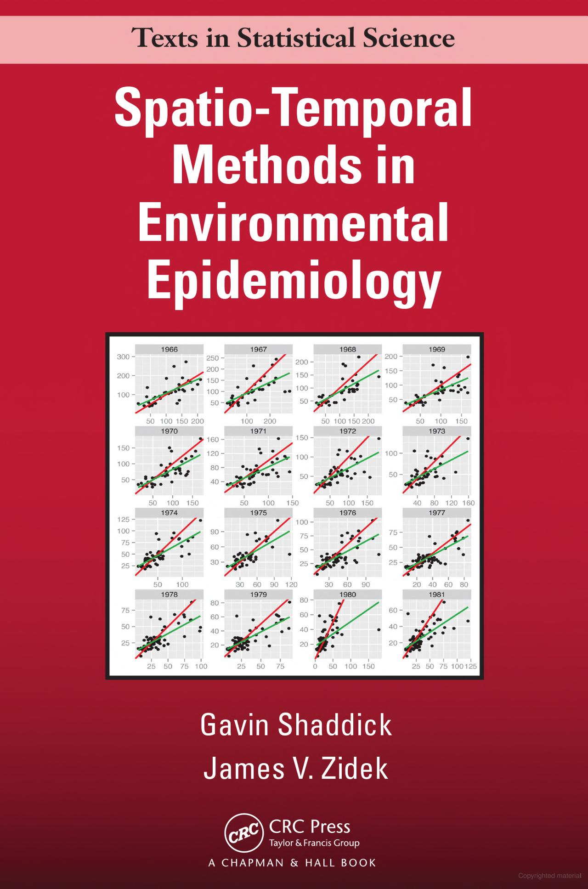

--- 
title: "Spatio-temporal methods in environmental epidemiology"
author: "Gavin Shaddick and James V Zidek"
date: "`r Sys.Date()`"
site: bookdown::bookdown_site
output:
  html_document:
      code_folding: hide
      toc: true
      toc_depth: 2
      toc_float:
        collapsed: false
        smooth_scroll: false
      theme: lumen
bibliography: [book.bib]
link-citations: yes
github-repo: rstudio/bookdown-demo
cover-image: "img/cover.jpg"

---

# Introduction {-}

This is the online companion for the book **Spatio-temporal methods in environmental epidemiology** published in [Chapman and Hall/CRC](https://www.taylorfrancis.com/books/mono/10.1201/b18600/spatio-temporal-methods-environmental-epidemiology-gavin-shaddick-james-zidek).

All the codes used for the examples in the book are presented here to ensure the material is reproducible, transparent, and accessible. 

Please feel free to contact us if you find any typos, or error in our code *Errare humanum est*.

